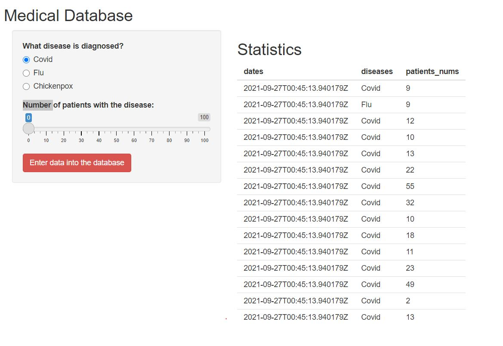

# Registration of morbidity

Application allows you to keep a hospital record of diagnoses made to patients for a certain period. User can:

+ Select the number of patients who have been given an accurate diagnosis since the last contact to the database
+ Choose one of three types of acceptable diagnoses: influenza / covid / chickenpox
+ In addition, the server generates a request date for each request and returns the request as a response.

# User interface of client app

# Tech stack

asgiref
Django
djangorestframework
psycopg2
Pygments
pytz
sqlparse

# Tools

[flake8](https://pypi.org/project/flake8/)